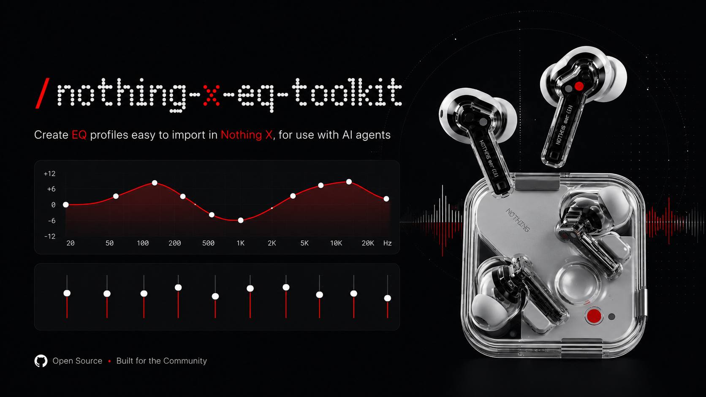
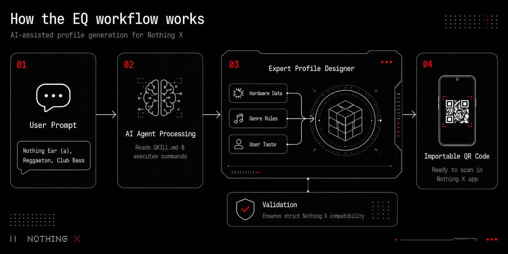

<div align="center">
  
  <br/>
  <h1>Nothing Ear EQ QR Profiles</h1>
  <p>An <b>Agent-First</b> toolkit for generating custom Nothing X advanced EQ QR codes.</p>
</div>

## Overview and Objective

This repository provides a comprehensive solution for designing and generating importable Advanced Equalizer (EQ) QR codes for the Nothing Ear ecosystem. 

The primary objective of this project is to bridge the gap between complex audio engineering principles and end-user accessibility by leveraging Artificial Intelligence. It includes an expert profile designer that synthesizes hardware compensation data, genre-specific tuning rules, and individual acoustic preferences to output highly optimized, safe, and ready-to-use EQ profiles.

## Agent-First Workflow

This repository is architected to be operated primarily by **AI Agents** (such as Cursor, GitHub Copilot, ChatGPT, or Claude). Users are not required to write code, configure development environments, or manually execute scripts. 

The repository includes a designated skill definition (`skills/nothing-ear-eq-expert/SKILL.md`) that instructs an AI agent on how to function as a specialized audio engineer. By interpreting this repository, the agent learns the technical constraints of the Nothing X app and can autonomously generate valid QR codes based on natural language requests.

<div align="center">
  
</div>

### Usage Instructions

1. **Initialize**: Open this repository in an Agent-enabled IDE or provide the repository files to your preferred AI assistant.
2. **Prompt**: Instruct the agent with your specific audio requirements, including your headphone model, preferred music genre, and tonal preferences (e.g., bass impact, vocal clarity).
3. **Import**: Scan the resulting QR code directly within the Nothing X mobile application.

### Example Prompt

Provide the following prompt to your AI agent to observe the workflow in action:

> *"Design an EQ profile for my Nothing Ear (a). I primarily listen to Reggaeton at the gym and prefer a club-bass response, but I need the vocals to remain entirely clear. Generate the QR code for import."*

### Example Output

The agent will synthesize the requested parameters and provide a clean, importable QR code alongside the technical EQ parameters:

<div align="center">
  
</div>

---

## Developer and Manual Usage

For developers and users who prefer to operate the toolset manually without an AI intermediary, this repository provides a complete CLI toolkit.

Features include:
- A reproducible Node.js generator for Nothing X QR payloads.
- An expert profile designer combining device tuning, genre rules, and user taste.
- AutoEq-lite support for selected Nothing hardware measurements.
- A suite of pre-validated EQ presets.

### Quick Start

```powershell
npm install
npm run import:autoeq
npm run validate
npm run generate
```

Generated QR codes are written to the `qr/` directory. These PNG files can be scanned directly from the Nothing X app.

### Expert Designer CLI

Generate a new profile manually by specifying hardware, genre, and taste parameters:

```powershell
npm run design -- --device=nothing-ear-2024 --genre=reggaeton --context=gym --target=club-bass --bass=1 --vocal=1 --treble=0 --energy=1 --name="Reggaeton Expert"
```

Alternatively, launch the guided assistant:

```powershell
npm run design
```

To generate the acceptance examples for the agent workflow:

```powershell
npm run design:examples
```

## Supported Genres

The expert designer includes calibrated tuning rules for 16 musical genres and use cases:

| Genre | ID | Sonic Focus |
|---|---|---|
| Reggaeton | `reggaeton` | Sub-bass and dembow base with vocal clarity |
| Pop Vocal | `pop` | Forward vocal, clean chorus lift, bright but controlled |
| Hip Hop | `hip-hop` | Sub and 808 weight with vocal articulation |
| Electronic / EDM | `electronic-club` | Deep sub, clean kick, energetic presence |
| House | `house` | Punchy 4-to-the-floor kick, warm bassline, clear claps |
| Hardstyle | `hardstyle` | Distorted kick impact, aggressive screech synth, tight tail |
| Rock | `rock` | Guitar presence, snare attack, vocal cut |
| Metal / Heavy | `metal` | Defined double kick, guitar bite, controlled cymbals |
| R&B / Soul | `r-and-b` | Warm sub, rich low-mids, silky vocal presence |
| Latin Pop / Bachata / Salsa | `latin-pop` | Guitar warmth, bright percussion, vocals forward |
| K-Pop | `kpop` | Polished vocals, punchy bass, controlled brightness |
| Jazz | `jazz` | Warm upright bass, clean piano, airy cymbals |
| Flamenco | `flamenco` | Guitar body, palmas presence, cante clarity |
| Lo-fi / Chill / Ambient | `lofi-chill` | Rolled-off highs, warmth, vinyl-like mids |
| Piano / Acoustic / Classical | `piano-acoustic` | Natural body, hammer attack, harmonics and air |
| Video / Podcast / Dialogue | `video-voice` | Dialogue intelligibility with controlled bass |

## Supported Devices

| Device | AutoEQ Source | Confidence |
|---|---|---|
| Nothing Ear 2024 | DHRME, RTINGS B&K 5128 | High |
| Nothing Ear (a) | DHRME, RTINGS B&K 5128 | High |
| Nothing Ear (2) | Super Review, RTINGS HMS II.3 | High |
| Nothing Ear (1) | RTINGS HMS II.3 | Medium-High |
| Nothing Ear (3) | Heuristic fallback | Low |
| Generic Nothing X | Conservative defaults | Low |

## Synthesis Engine

The profile designer uses a multi-layer synthesis pipeline to generate hardware-optimized EQ profiles:

1. **Genre Base Curve**: Foundational gain, frequency, and Q values calibrated per genre.
2. **User Preference Deltas**: Five taste dimensions (bass, vocal, treble, energy, warmth) scaled from -2 to +2.
3. **Target Curve Offsets**: Tonal targets (natural, club-bass, vocal-clarity, soft-treble, low-volume) add band-specific deltas.
4. **AutoEQ Consensus**: Uses every imported measurement for the device and lowers correction strength where sources disagree.
5. **Device Compensation**: Per-model gain correction and risk-band attenuation.
6. **Context Adjustments**: Psychoacoustic gain offsets for noisy, low-volume, and high-energy environments.
7. **Q Responsiveness**: Targets modify per-band bandwidth for surgical or diffuse EQ.
8. **Bass Enhance Candidates**: Evaluates Off vs Level 1 when bass-heavy listening may benefit from hardware enhancement.
9. **Gain Budget**: Reduces excessive positive gain automatically because Nothing X QR profiles do not encode preamp.
10. **Quality Scoring**: Scores candidates for bass impact, vocal clarity, fatigue, mud, air and measurement confidence.
11. **Preference Conflict Detection**: Warns when opposing preferences (e.g., bass+vocal) may reduce profile quality.

## Repository Structure

```text
src/
  nothing-x-eq.js              Core encoder, validator, QR writer
  autoeq-adapter.js            AutoEq CSV adapter to Nothing X bands
  bass-enhance-model.js        Bass Enhance candidate model
  profile-designer.js          Expert profile synthesis engine
  profile-scorer.js            Gain budget and candidate scoring
scripts/
  import-autoeq.js             Downloads selected Nothing AutoEq CSV/README files
  generate-qrs.js              Generate QR files from presets
  validate-profiles.js         Validate presets before QR generation
presets/
  default-profiles.json        Recommended profiles
  example-custom-profile.json  Template for a new profile
devices/
  *.json                       Nothing Ear model compensation data
autoeq-sources/
  manifest.json                Selected AutoEq Nothing sources
  data/                        Downloaded selected CSV/README source files
targets/
  *.json                       Tonal targets used by the expert designer
profiles/
  genre-rules/*.json           Genre and use-case tuning rules
docs/
  agent-guide.md               How an agent should design new profiles
  autoeq-lite.md               Scoped AutoEq import/adaptation details
  expert-designer.md           Device + genre + taste synthesis model
  nothing-x-format.md          QR payload format and compatibility rules
  repo-workflow.md             Clone/edit/generate workflow
legacy/
  README.md                    Historical one-off scripts and experiments
skills/
  nothing-ear-eq-expert/       Reusable Codex skill for this domain
qr/                            Clean generated QRs ready for Nothing X
```

## Nothing X Compatibility Rules

The Nothing X application enforces strict validation on imported payloads. A generic QR scanner may successfully decode the image, but the app will reject it if frequencies fall outside permitted bounds.

| Band | Valid Range (Hz) |
| --- | --- |
| 1 | 20 - 100 |
| 2 | 100 - 200 |
| 3 | 200 - 400 |
| 4 | 400 - 1000 |
| 5 | 1000 - 3000 |
| 6 | 3000 - 6000 |
| 7 | 6000 - 12000 |
| 8 | 12000 - 20000 |

The included validator script enforces these ranges automatically. Manual bypass of this validation is strongly discouraged. Further technical details can be found in `docs/nothing-x-format.md`.

## QR Payload Specification

The QR code encodes a Base64 string representing a gzip-compressed binary payload structured as follows:

```text
00 60
8 bands:
  gain float32 little-endian
  frequency float32 little-endian
  Q float32 little-endian
01
profile_name_length_bytes
profile_name_utf8
```

Note: The "Bass Enhance" setting is independent of the Advanced EQ payload and must be applied by the user manually.

## Disclaimer

This project is not affiliated with, endorsed by, or sponsored by Nothing. It is an independent toolkit that generates payloads compatible with the Nothing X EQ import functionality based on observational testing.
